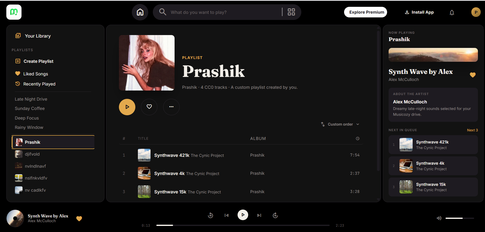
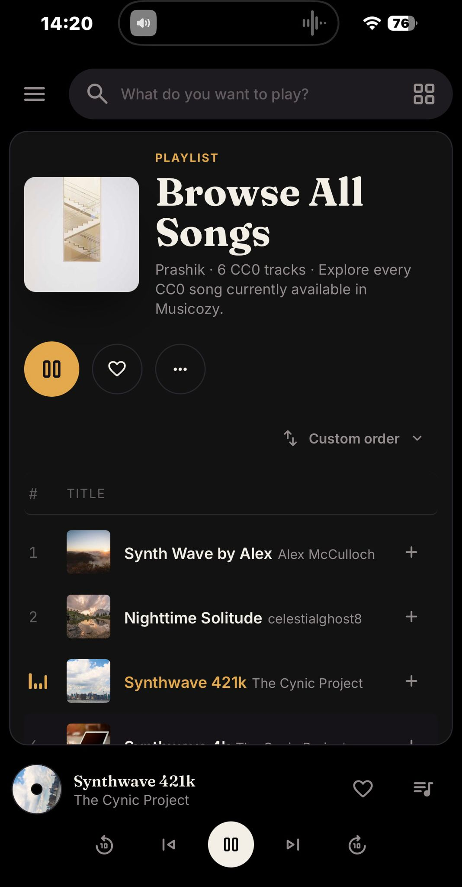

# Musicozy

Musicozy is a responsive, Spotify-inspired music player built as a front-end portfolio project with HTML, CSS, and vanilla JavaScript.

It combines working audio playback with persistent likes, custom playlists, cover uploads, sorting, search, recently played history, keyboard controls, and a responsive three-panel interface.

## Live Demo

Try Musicozy in your browser: [Open the live demo](https://iamprashik.github.io/Musicozy/).

## Screenshots

### Desktop



### Mobile



> [!NOTE]
> Musicozy is an independent educational project. It is not affiliated with, endorsed by, or connected to Spotify.

## Project status

Version 1.0 — live on GitHub Pages. The core experience is complete and has been regression-tested on desktop and responsive layouts.

## Highlights

- Play, pause, previous, next, seek, volume, mute, and 10-second skip controls
- Dynamic player tooltips and synchronized Now Playing information
- Home, Browse All Songs, search, Liked Songs, and Recently Played views
- Persistent likes, playback position, volume, listening history, and playlist preferences
- Create, rename, delete, favorite, and sort custom playlists
- Add or remove songs from playlists and reorder custom-playlist tracks by drag-and-drop or keyboard
- Upload, crop, zoom, save, and remove custom playlist covers
- Responsive sidebar and Now Playing drawers for smaller screens
- Keyboard-accessible song rows, dialogs, sliders, menus, and visible focus states
- Friendly audio-loading and playback error recovery
- Demo notices for Premium and Install controls, plus a Notifications status popup

## Built with

- Semantic HTML5
- Modern CSS, Grid, Flexbox, custom properties, and responsive media queries
- Vanilla JavaScript
- The native HTML audio element
- `localStorage` for lightweight preferences and library data
- IndexedDB for uploaded custom-cover image blobs
- Google Fonts and Material Symbols

There is no framework, package installation, build command, account, or back-end service.

## Run locally

1. Clone the repository:

   ```bash
   git clone https://github.com/iamprashik/Musicozy.git
   cd Musicozy
   ```

2. Confirm these root files are present: `index.html`, `style.css`, `script.js`, and `logo.png`.

3. Start a local server. For example:

   ```bash
   python -m http.server 8000
   ```

4. Open `http://localhost:8000` in a modern browser.

VS Code Live Server works as well. A network connection is needed for the current music streams, placeholder cover artwork, fonts, and icons.

## Keyboard controls

| Shortcut | Action |
| --- | --- |
| `Space` | Play or pause |
| `M` | Mute or unmute |
| `N` | Play the next track |
| `P` | Play the previous track |
| `Left Arrow` | Skip back 10 seconds |
| `Right Arrow` | Skip forward 10 seconds |
| `Up Arrow` | Increase volume |
| `Down Arrow` | Decrease volume |
| `Alt` + `Up Arrow` | Move a focused custom-playlist song up |
| `Alt` + `Down Arrow` | Move a focused custom-playlist song down |
| `Escape` | Close an open menu, notice, dialog, or responsive drawer |

Shortcuts are paused while typing in an input or working inside a dialog. Focused progress and volume sliders also support arrow, Home, and End keys.

## Browser storage

Musicozy stores its state locally in the current browser:

- `localStorage` keeps likes, recently played history, custom playlists, favorites, sorting choices, volume, and the playback session.
- IndexedDB keeps uploaded playlist-cover images.

No personal data or uploaded cover image is sent to an application server. Clearing the site's browser data resets the saved library and preferences.

## Project structure

```text
musicozy/
├── index.html
├── style.css
├── script.js
├── logo.png
├── README.md
├── CREDITS.md
├── LICENSE
├── screenshots/
│   ├── musicozy_desktop.png
│   └── musicozy_mobile.jpeg
└── .gitignore
```

## Known limitations

- Music and placeholder covers are loaded from third-party URLs, so playback and artwork require internet access.
- Saved data is local to one browser profile and is not synchronized between devices.
- Premium, Install, and Notifications are portfolio-demo interactions rather than account-backed services.
- There is no authentication, server database, recommendation engine, or offline media cache.

## Credits and licensing

The Musicozy source code is available under the [MIT License](LICENSE). That license applies only to this project's original source code.

Music, placeholder imagery, fonts, icons, and other third-party material remain subject to their respective licenses. See [CREDITS.md](CREDITS.md) for the complete source and attribution list.

## Author

Built by [Prashik Koirala](https://github.com/iamprashik).
